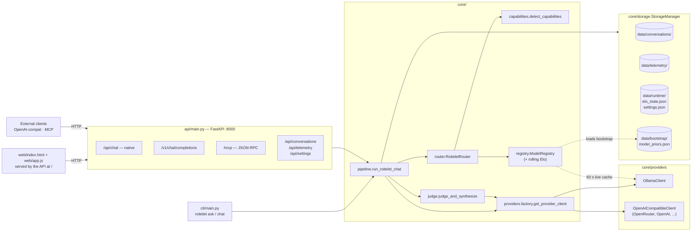
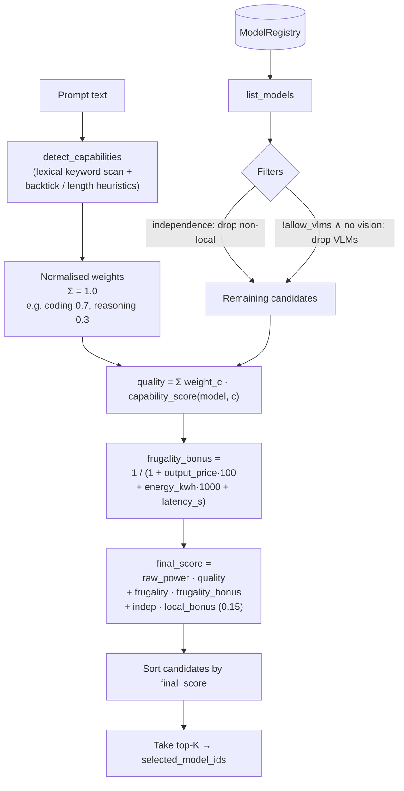
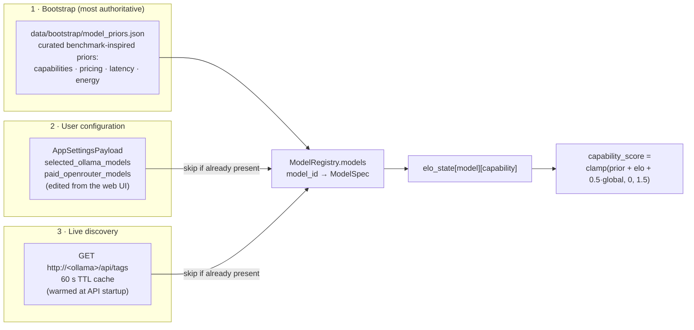
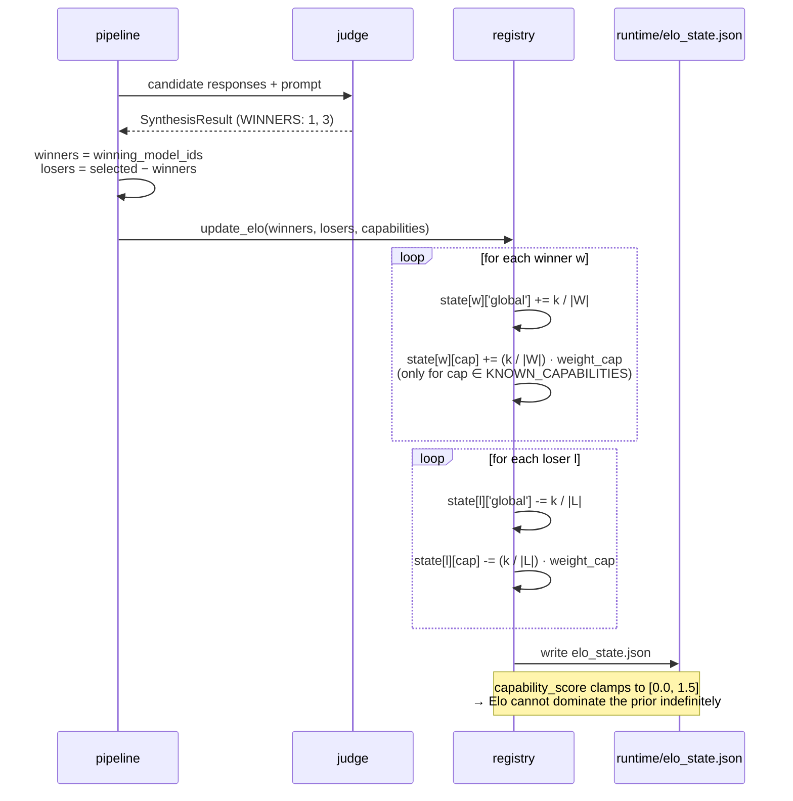
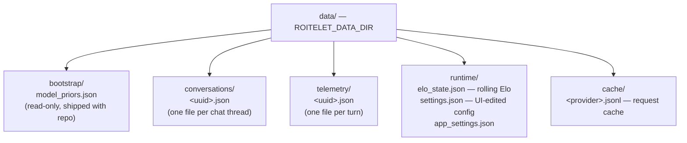

# How Roitelet Works

A field guide to what happens inside Roitelet when you send it a prompt. This
document complements the README (which explains *what* and *why*) by walking
through the *how* — the modules, the data flow, the scoring, and the feedback
loop. Diagrams are authored in Mermaid and render directly on GitHub.

---

## 1. Component map

Three frontends share the same brain. Only the API talks to the pipeline; the
GUI sits on top of the API over HTTP. The CLI imports the pipeline directly.

**Key idea**: the *router* picks which models to ask, *providers* dispatch in
parallel, the *judge* (a local model) synthesises one answer, and the
*registry* updates rolling Elo scores so future routing improves.

---

## 2. Single-turn request lifecycle

The whole pipeline lives in `core/core/pipeline.py:run_roitelet_chat`. Every
frontend ends up calling this one function. Below is exactly what happens for
one prompt.

A few details worth pinning down:

- **Parallel fan-out** uses `asyncio.gather` — the slowest of the K calls sets
  the wall-clock latency, not the sum.
- **Partial failure is tolerated**: if one provider errors, the judge only
  sees the survivors. If *all* fail, the judge still runs (with empty content)
  to keep the response shape consistent.
- **Telemetry records every response**, including failed ones — failures must
  be visible in the audit trail, not hidden.

---

## 3. Capability detection and router scoring

`RoiteletRouter.route` is pure Python — no model calls. It scores every
registered candidate on a blend of *quality* (Elo-adjusted priors weighted by
detected capabilities) and *frugality* (cost + energy + latency), modulated by
user preferences.

**Why per-capability scores?** A model's coding ability and its translation
ability are decoupled. A global Elo would average them away. Roitelet keeps
one rolling adjustment *per capability per model* (`registry._load_elo_state`),
plus a `global` term that contributes at half-weight. The final score for a
prompt is therefore tilted toward models that are strong on the *specific*
capabilities the prompt demands.

---

## 4. The model registry: three sources, in priority order

The registry is rebuilt on every call to `router.route` to pick up new models
without a restart. Sources are merged in order of *decreasing* authority —
earlier sources win on conflict.

**Why the priority**: bootstrap is curated and reflects real benchmark data,
so it should never be clobbered by a defaulted entry. User config wins over
live discovery because the user explicitly named those models. Live discovery
exists so a fresh `ollama pull foo` shows up in the router within one TTL
window without touching settings.

---

## 5. The Elo feedback loop

After each turn, the judge's winners gain Elo, the losers lose Elo — both
globally and on every capability the prompt invoked. The K-factor is small
(0.04) so individual turns nudge rather than swing.

**Two safeguards in this loop**:

1. Only capabilities in `KNOWN_CAPABILITIES` are allowed into the state file
   (`registry.py`). A typo or a novel capability string cannot grow the file.
2. The final `capability_score` clamps to `[0.0, 1.5]`. Even with sustained
   wins, a model's effective score cannot run away — it asymptotes against
   the ceiling.

---

## 6. On-disk layout

Roitelet deliberately avoids a database. Everything is JSON, atomically
written, easy to inspect with `cat` and `jq`.

Writes go through `StorageManager._write_json` which uses the
write-temp-then-`os.replace` pattern, so a crash mid-write cannot corrupt an
existing file — readers either see the old version or the new one, never a
half-formed mix.

---

## 7. Where to read next

| Module | Lines | What to look for |
|---|---|---|
| `core/core/pipeline.py` | ~170 | The whole orchestration in one file — start here |
| `core/core/router.py` | ~115 | The scoring formula and the filter logic |
| `core/core/registry.py` | ~380 | Bootstrap loading, live discovery, Elo update |
| `core/core/capabilities.py` | ~125 | Keyword lists + normalisation |
| `core/core/judge.py` | ~95 | Prompt building, WINNERS parsing, synthesis fallback |
| `core/providers/openai_compatible.py` | ~120 | The contract every remote provider must satisfy |
| `api/main.py` | ~300 | All three API surfaces in one file |
| `tests/test_pipeline.py` | ~230 | Worked example of running the pipeline end-to-end with stubs |
