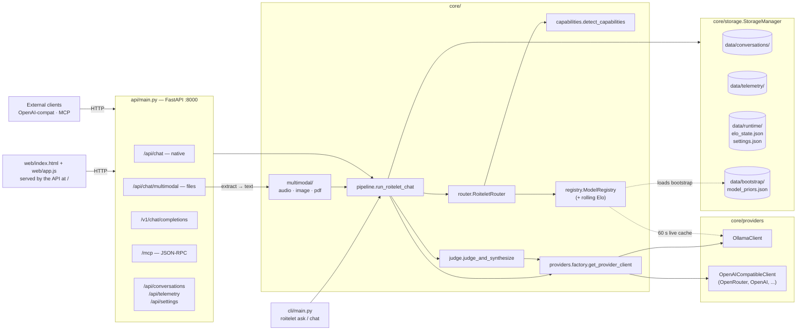
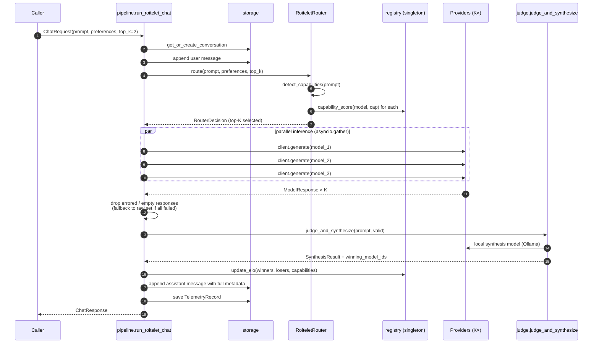
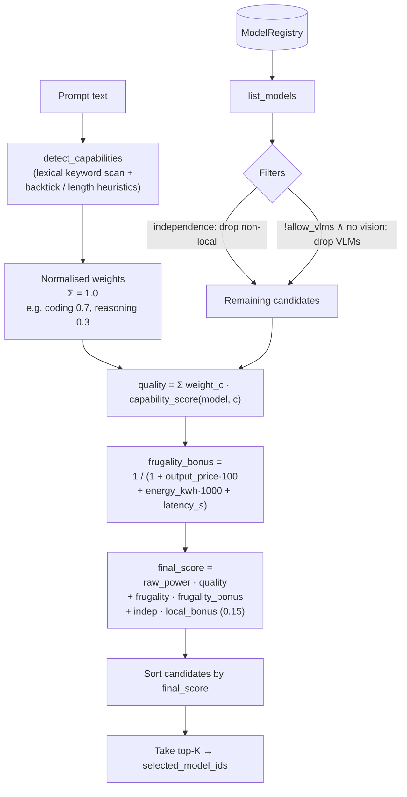
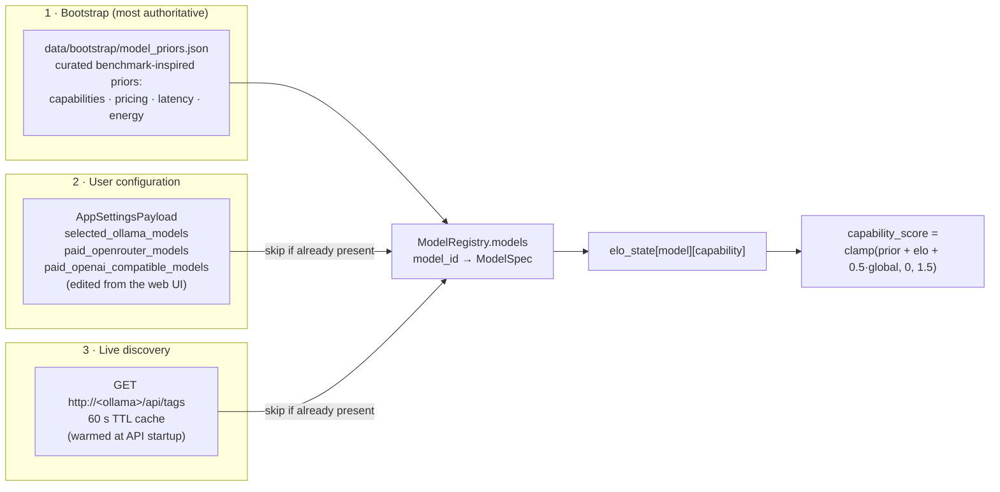
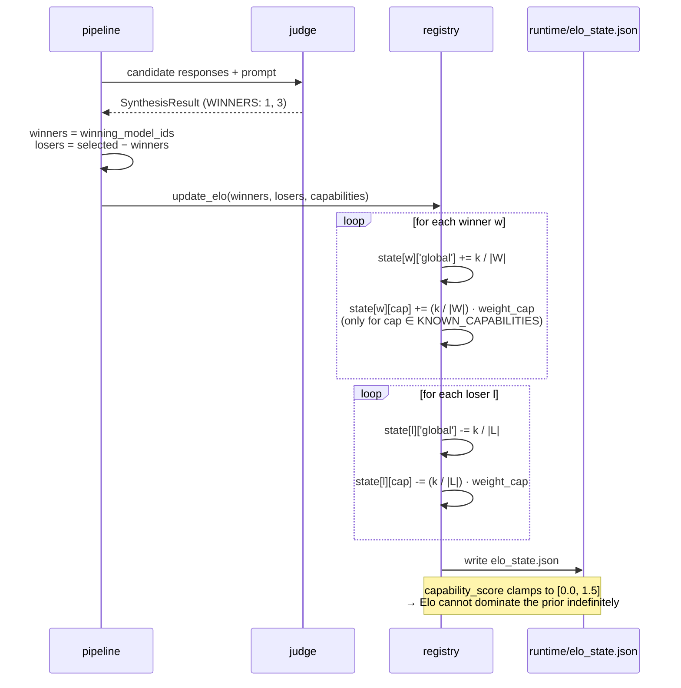
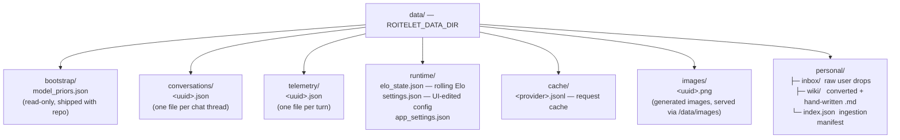

# How Roitelet Works

A field guide to what happens inside Roitelet when you send it a prompt. This
document complements the README (which explains *what* and *why*) by walking
through the *how* — the modules, the data flow, the scoring, and the feedback
loop. Diagrams are authored in Mermaid and render directly on GitHub.

---

## 1. Component map

Three frontends share the same brain. Only the API talks to the pipeline; the
GUI sits on top of the API over HTTP. The CLI imports the pipeline directly.



**Key idea**: the *router* picks which models to ask, *providers* dispatch in
parallel, the *judge* (a local model) synthesises one answer, and the
*registry* updates rolling Elo scores so future routing improves.

---

## 2. Single-turn request lifecycle

The whole pipeline lives in `core/pipeline.py:run_roitelet_chat`. Every
frontend ends up calling this one function. Below is exactly what happens for
one prompt.



A few details worth pinning down:

- **Parallel fan-out** uses `asyncio.gather` — the slowest of the K calls sets
  the wall-clock latency, not the sum.
- **Partial failure is tolerated**: if one provider errors, the judge only
  sees the survivors. If *all* candidates fail, the pipeline raises
  `AllCandidatesFailedError` — the API layer maps this to **HTTP 502** with the
  per-model failures rather than fabricating a fake synthesis from empty
  content.
- **Telemetry records every response**, including failed ones — failures must
  be visible in the audit trail, not hidden.
- **Multimodal preprocessing** happens *before* the pipeline runs:
  `/api/chat/multimodal` transcribes audio, captions images, and extracts PDF
  text using local models, then concatenates the result into the prompt that
  flows into the text-only pipeline above.

---

## 3. Capability detection and router scoring

`RoiteletRouter.route` is pure Python — no model calls. It scores every
registered candidate on a blend of *quality* (Elo-adjusted priors weighted by
detected capabilities) and *frugality* (cost + energy + latency), modulated by
user preferences.



**Why per-capability scores?** A model's coding ability and its translation
ability are decoupled. A global Elo would average them away. Roitelet keeps
one rolling adjustment *per capability per model* (`registry._load_elo_state`),
plus a `global` term that contributes at half-weight. The final score for a
prompt is therefore tilted toward models that are strong on the *specific*
capabilities the prompt demands.

### Regime-aware hybrid math

The linear blend above is the *default* math. Before scoring, the
router calls `core.regimes.detect_regime` to classify the turn into
one of six regimes and applies regime-specific adjustments:

| Regime | Trigger | What changes |
|---|---|---|
| `budget_constrained` | `preferences.max_cost_usd` is set | Candidates whose cost exceeds the budget are filtered *before* scoring. |
| `trivial` | Short prompt (≤ 80 chars, ≤ 16 words) | Suggests `top_k=1` (advisory — the pipeline honours the caller's K). |
| `long_context` | Prompt > 4000 chars | Surfaces the label; capability detector already over-weights `long_context`. |
| `capability_dominant` | One capability holds > 55 % of weight | Surfaces the label; standard per-capability scoring drives selection. |
| `ambiguous` | No capability above 30 % of weight | Boosts the `global` Elo term to bias toward generalists. |
| `default` | Anything else | Standard linear blend, no adjustments. |

The regime label and rationale are written into `RouterDecision.reasoning`
so the choice is auditable in telemetry. This is what "hybrid routing"
means in Roitelet: one router, one set of priors, but *which math to
apply* is a per-turn decision driven by the prompt + preferences shape.

---

## 4. The model registry: three sources, in priority order

The registry is rebuilt on every call to `router.route` to pick up new models
without a restart. Sources are merged in order of *decreasing* authority —
earlier sources win on conflict.



**Why the priority**: bootstrap is curated and reflects real benchmark data,
so it should never be clobbered by a defaulted entry. User config wins over
live discovery because the user explicitly named those models. Live discovery
exists so a fresh `ollama pull foo` shows up in the router within one TTL
window without touching settings.

**Universal extension point**: any paid LLM with an OpenAI-compatible
`/v1/chat/completions` endpoint — Mistral, Together, Groq, Anyscale,
Fireworks, llama.cpp's `llama-server` — registers via the
``paid_openai_compatible_models`` list in user configuration. The factory
routes ``openai-compatible/<name>`` requests against the configured
``OPENAI_COMPATIBLE_BASE_URL`` and ``OPENAI_COMPATIBLE_API_KEY``. Walked
through in [`docs/ADDING_PAID_LLM.md`](docs/ADDING_PAID_LLM.md) and
[`docs/ADDING_LOCAL_LLM.md`](docs/ADDING_LOCAL_LLM.md).

### Refreshing the bootstrap priors

`data/bootstrap/model_priors.json` is curated, not generated, but
`scripts/crawl_arena.py` exists to refresh the **reasoning** /
**analysis** numbers from a Chatbot Arena snapshot whenever model
relative strength shifts (typically after a major model release).

```bash
# 1. Refresh from the LMSYS leaderboard page (or any URL / local file
#    with parseable Elo numbers).
python scripts/crawl_arena.py https://huggingface.co/spaces/lmsys/chatbot-arena-leaderboard

# 2. (optional) Validate the resulting JSON with the test suite.
pytest tests/test_scripts.py -q
```

Every touched entry receives a ``_meta`` block recording lineage:

```json
"openai/gpt-4.1": {
  ...,
  "_meta": {
    "source": "https://huggingface.co/spaces/lmsys/chatbot-arena-leaderboard",
    "elo_raw": 1287,
    "elo_normalized": 1.20,
    "refreshed_at": "2026-05-25T19:30:00+00:00"
  }
}
```

Entries the crawler couldn't match in the leaderboard are left
untouched (no ``_meta`` mutation), so manual edits to local-only or
specialist priors survive a refresh. Updates are smoothed 50/50 with
the existing prior to avoid one bad leaderboard scrape wiping out
months of accumulated Elo signal.

---

## 5. The Elo feedback loop

After each turn, the judge's winners gain Elo, the losers lose Elo — both
globally and on every capability the prompt invoked. The K-factor is small
(0.04) so individual turns nudge rather than swing.



**Two safeguards in this loop**:

1. Only capabilities in `KNOWN_CAPABILITIES` are allowed into the state file
   (`registry.py`). A typo or a novel capability string cannot grow the file.
2. The final `capability_score` clamps to `[0.0, 1.5]`. Even with sustained
   wins, a model's effective score cannot run away — it asymptotes against
   the ceiling.

---

## 5.4 Alternative capability detector: `ROITELET_CAPABILITY_DETECTOR=embedding`

The default capability detector is the keyword scan in
`core/capabilities.py` — transparent and English-biased. An alternative
detector trains a sklearn logistic regression on top of locally-served
sentence embeddings from Ollama's `nomic-embed-text` model (or whatever
`ROITELET_EMBED_MODEL` points at).

Behaviour:

- **Default**: keyword scan, identical to all previous releases.
- **`ROITELET_CAPABILITY_DETECTOR=embedding`**: classifier path; on any
  failure (Ollama unreachable, embedding model not pulled, classifier
  untrained because the labelled corpus is too small) it transparently
  falls back to the keyword scan. The router never sees an empty
  distribution.

Training corpus today is the eval dataset under
`tests/eval/dataset.json` — its `category` field is the label. Extend
it by adding more labelled JSON entries and calling
`core.capability_classifier.refresh_classifier()`.

---

## 5.5 Alternative router: `ROITELET_ROUTER=mf`

A second router lives in `core/router_mf.py`: a learned matrix-factorisation
prototype that reads accumulated telemetry and blends a learned per-prompt
quality score with the heuristic's per-capability score.

| Aspect | Heuristic (default) | Learned MF (opt-in) |
|---|---|---|
| **Selection signal** | Curated priors + rolling Elo + keyword detector | Same, blended 50/50 with TF-IDF + truncated-SVD per-model centres trained on `data/telemetry/` |
| **Trains on** | Nothing — priors edited by hand or `crawl_arena.py` | Per-turn winners crowned by the synthesis judge |
| **Cold-start behaviour** | Always works | Falls back to heuristic until ≥ 32 telemetry turns exist |
| **Activation** | Default | `ROITELET_ROUTER=mf` env var before launch |
| **Cost** | Zero — pure Python | TF-IDF + 16-component SVD over telemetry on startup; sklearn already a runtime dep |

The learned router never *replaces* the heuristic — it composes it. The
cost-budget regime, the ambiguous-prompt generalist boost, and the
independence filter all keep working. The only change is the quality
term in the linear blend.

**Why it isn't yet the default**: we don't have a head-to-head benchmark
proving it beats the heuristic. The Pareto runner under
`tests/eval/bench_pareto.py` is the seam for that comparison — once it
shows a consistent improvement across the eval dataset, the env-var
gate can be flipped to "default learned with `=heuristic` opt-out."

---

## 5.6 Personal mode

A separate pipeline branch (`core/personal.py`) implements two
related patterns over one corpus:

```mermaid
flowchart LR
    INBOX[("data/personal/inbox/<br/>raw files (audio/image/pdf/md)")]
    INBOX --> EX[Multimodal extractors:<br/>whisper · Ollama VLM · kreuzberg]
    EX --> WIKI[("data/personal/wiki/<br/>.md files w/ provenance header")]
    HAND[Hand-written .md] --> WIKI

    Q[User prompt with /personal]
    WIKI --> SIZE{Total chars ≤ 32k?}
    SIZE -- yes --> CAT[Concatenate full wiki<br/>(Karpathy LLM-wiki)]
    SIZE -- no --> RAG[Chunk · embed via nomic-embed-text<br/>top-K cosine retrieval]
    CAT --> CTX[Personal-context block]
    RAG --> CTX
    CTX --> PIPE[Standard top-K fan-out + fusion]
    Q --> PIPE
    Q -. drives retrieval .-> RAG
```

The **wiki mode** (small corpora, ≤ 32 k chars ≈ 8 k tokens)
concatenates every wiki file and injects the whole thing as long
context. This is the Karpathy LLM-wiki pattern: the model sees your
entire notebook on every turn.

The **RAG mode** (large corpora) chunks each wiki file at
1 200 chars with 200-char overlap, embeds via local
`nomic-embed-text`, and retrieves the top-5 cosine-nearest chunks.
On any embedding failure the personal-context injection silently
skips — the turn runs as a normal chat (the assistant will say "I
don't have that in your notes").

**Embedding visualisation** (Karpathy-style scatter): the same
embeddings drive a 2-D PCA projection rendered as an SVG in the web
control room (settings sheet → *Visualize*) and as a standalone HTML
file from `python -m cli personal viz --output personal-viz.html`.
Each dot is one chunk; colour is the source file. The projection
runs in memory on every request and skips when the embedding model
is unreachable.

---

## 6. On-disk layout

Roitelet deliberately avoids a database. Everything is JSON, atomically
written, easy to inspect with `cat` and `jq`.



Writes go through `StorageManager._write_json` which uses the
write-temp-then-`os.replace` pattern, so a crash mid-write cannot corrupt an
existing file — readers either see the old version or the new one, never a
half-formed mix.

---

## 7. Where to read next

| Module | Lines | What to look for |
|---|---|---|
| `core/pipeline.py` | ~225 | The whole orchestration in one file — start here |
| `core/router.py` | ~150 | The scoring formula, regime hooks, and filter logic |
| `core/regimes.py` | ~155 | The six regimes that drive hybrid routing math |
| `core/router_mf.py` | ~290 | Learned matrix-factorisation router (opt-in alt) |
| `core/registry.py` | ~480 | Bootstrap loading, live discovery, Elo update |
| `core/capabilities.py` | ~140 | Keyword lists + normalisation |
| `core/judge.py` | ~255 | Anonymized handles, WINNERS sentinel, fail-closed parse |
| `core/multimodal/` | ~420 | Audio (whisper.cpp + NeMo), image (Ollama VLM), PDF (kreuzberg) |
| `core/providers/openai_compatible.py` | ~120 | The contract every remote provider must satisfy |
| `api/main.py` | ~490 | All four API surfaces (native, multimodal, OpenAI-compat, MCP) in one file |
| `tests/eval/bench_pareto.py` | ~250 | Cost-quality Pareto: fusion vs single-best baseline |
| `core/capability_classifier.py` | ~260 | Embedding-based capability detector (opt-in) |
| `core/image_pipeline.py` | ~160 | K=1 image-generation pipeline |
| `core/providers/openai_images.py` | ~200 | OpenAI-compatible image-generation client |
| `core/personal.py` | ~380 | Inbox → wiki ingestion + size-dependent context strategy + PCA viz |
| `core/commands.py` | ~210 | Slash-command parser (`/image`, `/personal`, `/local`, …) |
| `tests/test_pipeline.py` | ~470 | Worked example of running the pipeline end-to-end with stubs |
