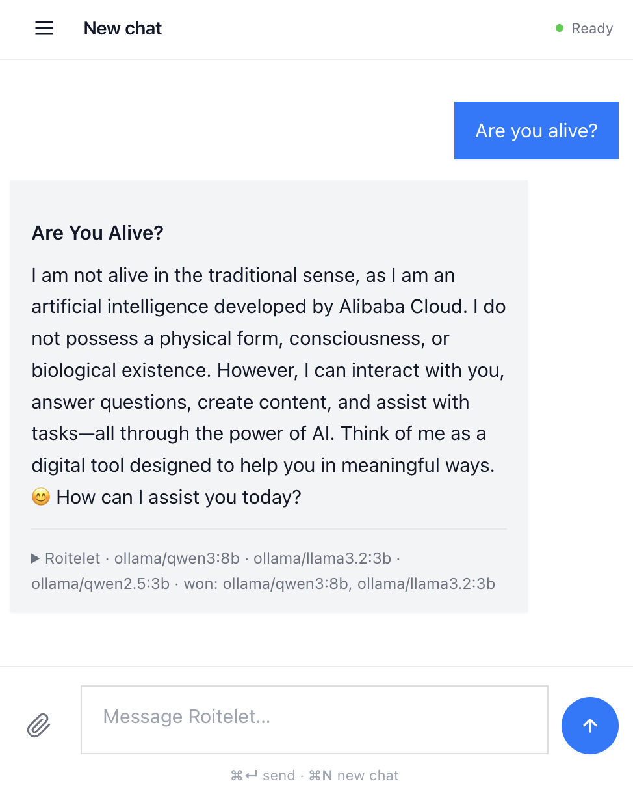

# Roitelet LLM

> **A local-first LLM routing and fusion workbench.** Roitelet routes
> prompts across local and remote language models, compares their
> answers, synthesizes a final response locally, and learns routing
> preferences over time from its own judge signal.


---

## The wren

Once upon a time, the birds of the forest agreed that whoever flew
highest would be crowned king. The eagle climbed effortlessly past
every other bird. But a tiny wren had hidden in the eagle's feathers,
rode all the way up, and at the very top fluttered a few wingbeats
higher to take the crown.

The point isn't that the wren is the strongest bird — it isn't. The
point is what small, well-placed local moves can do on top of much
larger external forces. Roitelet (*roitelet* is French for "wren") is
shaped around the same idea: a small local pipeline that rides on top
of large language models — composing them, comparing their answers,
running its own local synthesis pass on top.

### How that translates to the pipeline

For a given prompt, Roitelet:

1. **Picks the flight formation.** A hybrid router scores every
   registered model (local + optional remote) on curated capability
   priors, rolling Elo, and a small set of regime-aware filters
   (cost budget, trivial-prompt, long-context, …), then takes the
   top-K (default K=2 — the empirical sweet spot from
   [docs/EVALUATION.md §4.3](docs/EVALUATION.md); override per turn).
2. **Lets them fly in parallel.** The K candidates answer
   concurrently via `asyncio.gather`; one slow provider doesn't block
   the others.
3. **Adds the wren's wingbeat.** A local synthesis judge reads the K
   answers — anonymised and shuffled, so it can't recognise model
   identities — and fuses them into a single response.
4. **Remembers what worked.** Per-turn telemetry lands as JSON on
   disk, and the rolling per-capability Elo nudges the next routing
   decision.

Every step is inspectable. The router decision, the candidate replies,
the judge's reasoning, and the Elo state are all plain JSON files;
nothing is hidden behind an opaque service.

---

## What this is good for

- **Comparing model families** on the same prompt without juggling
  three SDKs.
- **Running a local synthesis pass** on top of remote candidate
  answers — useful when you want the final word to come from a model
  you control.
- **Experimenting with routing and fusion strategies** (cost-budget
  filters, learned matrix-factorisation router, embedding-based
  capability detector) under a single API.
- **Studying tradeoffs** between cost, latency, privacy, and answer
  quality, with the data trail to make those studies reproducible.

A few caveats worth knowing up front:

- The fused answer is not guaranteed to beat the strongest single
  candidate on every prompt class — that's exactly what the ablation
  roadmap in [docs/EVALUATION.md](docs/EVALUATION.md) is designed to
  measure.
- The synthesis judge is not an objective oracle. Roitelet learns
  *judge-conditioned* preferences; different judges produce different
  rolling-Elo trajectories. The judge bias is a property to inspect,
  not to hide.
- Roitelet is local-**first**, not local-**only**. Prompts go to
  remote providers when remote candidates are selected. See
  [docs/PRIVACY.md](docs/PRIVACY.md) for the precise distinction and
  the local-only switch.

---

## Features

- **Hybrid routing.** Capability priors + rolling Elo + regime-aware
  adjustments (cost budget, trivial-prompt, long-context, ambiguous,
  capability-dominant). Optional learned matrix-factorisation router
  behind `ROITELET_ROUTER=mf`.
- **Parallel top-K fan-out.** Default K=2 (the §4.3 sweet spot),
  configurable per turn via `ROITELET_DEFAULT_TOP_K` or the
  `top_k` request field.
  Wall-clock time is bounded by the slowest selected candidate
  (see [latency + cost tradeoffs](#latency-and-cost-tradeoffs) below).
- **Local synthesis pass.** Candidate answers are anonymized,
  shuffled, and handed to a local Ollama model that fuses them.
  The judge is replaceable.
- **Per-capability rolling Elo.** Each turn's judge winners gain Elo
  on the capabilities the prompt invoked; losers lose. Bounded
  updates; no feedback runaway.
- **Universal extension point.** Any paid LLM with an OpenAI-compatible
  `/v1/chat/completions` endpoint registers in three settings fields.
  Same for any local GGUF served by `llama-server`.
- **Multimodal attachments.** Drop images, PDFs, or audio — extracted
  locally (Ollama VLM, kreuzberg, whisper.cpp + NeMo) before the
  text pipeline runs.
- **Image generation.** K=1 routing to the strongest registered
  image-gen model (no fusion — image ensembling is not a defined
  operation).
- **Personal mode.** Drop your own files into a folder; small corpora
  inject inline (Karpathy LLM-wiki style), large ones switch to
  embedding retrieval. Includes a 2-D PCA scatter of the corpus.
  See [docs/PERSONAL_MODE.md](docs/PERSONAL_MODE.md).
- **Two capability detectors.** Default keyword scan + opt-in
  embedding-based classifier on top of a local Ollama embedding model.
- **Slash commands.** `/image`, `/speech`, `/personal`, `/local`,
  `/cheap <usd>`, `/k <n>`, `/help`. See
  [docs/SLASH_COMMANDS.md](docs/SLASH_COMMANDS.md).
- **Standardized endpoints.** OpenAI-compatible `/v1/chat/completions`
  + `/v1/images/generations`, native FastAPI, MCP JSON-RPC.
- **Local telemetry.** Per-turn JSON records of the router decision,
  every candidate response (including failures), the synthesis, and
  the winners. See [docs/PRIVACY.md](docs/PRIVACY.md) for what's
  recorded.
- **Optional Bearer-token gate.** `ROITELET_API_TOKEN` locks every
  mutating + listing endpoint. Off by default to preserve the
  single-user-localhost UX.

---

## How Roitelet differs from neighbouring projects

Roitelet lives in an active space. The table below positions it
against the closest neighbours, fairly and at a high level. None of
these projects "lose" — they solve different problems.

| Project | Primary role | Strengths | How Roitelet differs |
|---|---|---|---|
| [**LiteLLM**](https://github.com/BerriAI/litellm) | Provider gateway / OpenAI-compatible abstraction over many APIs. | Broad provider coverage, drop-in OpenAI client, server mode, robust SDK. | Roitelet is narrower and more opinionated: local-first by default, focused on multi-model fan-out + a local synthesis pass + an inspectable rolling-Elo loop. LiteLLM is one of the providers Roitelet could plug into. |
| [**OpenRouter**](https://openrouter.ai) | Hosted marketplace + routing for many remote models behind one billing surface. | Huge model catalogue, hosted convenience, single API key. | Roitelet runs on your machine and lets you inspect / modify the routing and fusion loop. OpenRouter is an excellent *candidate provider* for Roitelet, not a replacement. |
| [**RouteLLM**](https://github.com/lm-sys/RouteLLM) | Research framework for cost-aware routing between a strong and a weak model, trained on human preference data. | Principled `P(strong wins)` estimator, published cost-quality Pareto curves, calibrated threshold knob. | Roitelet does top-K fan-out + fusion rather than binary routing, and is set up as a personal workbench rather than a research benchmark. RouteLLM's `mf` router slots cleanly behind Roitelet's `Router` Protocol if you want both. |
| [**LangChain / LangGraph**](https://www.langchain.com) | General LLM-orchestration frameworks. | Composable graphs, broad ecosystem, agent patterns. | Roitelet is an end-user system, not a framework. It ships an opinionated pipeline (router → parallel candidates → local judge → telemetry) with HTTP, CLI and web entry points, instead of leaving the orchestration to you. |
| [**DSPy**](https://github.com/stanfordnlp/dspy) | Programming model for compiling prompt pipelines, optimising them against metrics. | Powerful abstractions for optimisation-driven prompting and retrieval. | Roitelet doesn't compile programs — it routes and fuses at inference time, with the rolling-Elo loop as its only online "optimisation". DSPy and Roitelet can coexist (DSPy could be the candidate; Roitelet could be the runner). |
| **Single-model chat clients** (OpenAI playground, Ollama desktop, etc.) | One model in, one answer out. | Simple, fast, low-latency, low-cost. | Roitelet deliberately trades simplicity and latency for comparison, redundancy and synthesis. For a trivial prompt to a familiar model, those clients win. For "I want three opinions and a local synthesis", Roitelet is the one. |

The honest summary: Roitelet is a **workbench**, not a gateway, not a
hosted marketplace, not a framework, and not a chat client. Pick the
tool whose primary role matches what you're actually trying to do.

---

## Why fusion can help — and where the judge bias sits

The whole synthesis-judge idea rests on a single asymmetry:
**evaluating and synthesising is easier than creating from scratch.**

A judge that has K already-written candidate answers in front of it
does not have to know the answer; it has to compare drafts, find
overlaps, drop contradictions, preserve useful details, and emit a
single fused response. That's a fundamentally smaller task than
producing the first answer with no scaffolding. A relatively small
local model can do it credibly for the same reason a teaching
assistant can grade a stack of essays without being able to write
the best one themselves.

This asymmetry is what makes Roitelet's "small local model on top of
strong remote candidates" pipeline plausible at all. The judge's job
is curation, not invention.

### Does it actually help? (2026-05-26 K-sweep)

End-to-end run on the full 25-prompt mixed-task dataset,
local-only (3 small OSS candidates — `llama3.2:3b`, `qwen2.5:3b`,
`gemma3:4b`; `qwen3:8b` synthesis judge), graded by DeepEval
`GEval(correctness, threshold=0.6)`. Real K=3 (every K=3 turn
fanned out to all three candidates including Gemma; see the
[`fan_out=2` investigation](docs/EVALUATION.md) for why the first
attempt didn't):

| K | mean correctness | pass (≥0.6) | total latency | judge share |
|---|---|---|---|---|
| 1 | 0.87 | 23 / 25 | 32.1 s | 70 % |
| 2 | **0.95** | **25 / 25** | 55.9 s | 74 % |
| 3 | 0.96 | **25 / 25** | 112.1 s | 73 % |

**Headline:** K=1 → K=2 is **+8 pp mean correctness** (0.87 → 0.95)
and **+2 prompts cleared the threshold** (every K=2 case passes),
for **+24 s** of wall-clock. K=2 → K=3 hits a quality ceiling on
this dataset (+1 pp, still 25/25 passing) but **doubles wall-clock**
to 112 s. **K=2 is the sweet spot** on this judge / pool; K=3 is
not worth the cost. Multilingual is the category fusion helps most
(0.33 → 0.93 → 1.00); long-context regresses at K=3 (judge
over-curates and drops concrete examples).

Full numbers, per-category breakdown, the two DeepEval grader
errors at K=1 to be honest about, the caveats, and the K=2 →
investigate-the-judge follow-up live in
[docs/EVALUATION.md §4.3](docs/EVALUATION.md). Raw JSON reports
(`ksweep-20260526T*Z.json`, two of them — the first attempt that
exposed the VLM-filter interaction, and the rerun that fixed it)
are preserved in the ignored `eval_runs/` directory.

### And the judge matters — a lot (2026-05-26 judge-swap at K=2)

Holding the dataset, router, candidates and K fixed at the §4.3
sweet spot, only the synthesis judge is rotated across three sizes
(`qwen3:8b`, `gemma3:4b`, `llama3.2:3b`). Same `qwen3:8b` grader for
all three runs:

| Judge | mean correctness | pass (≥0.6) | mean judge latency |
|---|---|---|---|
| **qwen3:8b** (8B)   | **0.93** | 24 / 25 | 38.9 s |
| **gemma3:4b** (4B)  | 0.88     | 23 / 25 | 18.4 s |
| **llama3.2:3b** (3B) | 0.72    | 19 / 25 | 20.3 s |

**Headline:** the 8B judge beats the 3B judge by **+22 pp mean
correctness** on the same prompts with the same candidates — most of
the wall-clock you spend on Roitelet *is* the judge, and downsizing
it gives back substantial quality, not just speed. The 4B judge is
the Pareto sweet spot for latency-bound regimes (−5 pp for half the
judge wall-clock). All 25/25 prompts show winner-set disagreement
between judges; 8/25 show outright PASS/FAIL splits — strong
evidence that **Roitelet learns judge-conditioned preferences, not
universal ones**, exactly as the §1.1 mechanism section warned.

Per-category, the smaller judges' weak spots are **writing** (0.40
under llama3.2:3b vs 0.95–1.00 under the larger judges) and
**multilingual** (0.47 under gemma3:4b vs 0.97 under qwen3:8b). The
naive worry "judges prefer their own family" only shows up weakly
here; the stronger pattern is **anti-terse-candidate bias on smaller
judges** (gemma3:4b picks the terse `llama3.2:3b` candidate only
1/25 times). Full per-prompt breakdown and caveats:
[docs/EVALUATION.md §4.4](docs/EVALUATION.md). Raw JSON:
`judgeswap-20260526T123130Z.json`.

**But this is not free magic.** The judge is not an objective oracle:

- Roitelet learns *judge-conditioned* preferences. If Qwen is your
  local judge, the rolling-Elo loop will quietly internalise what Qwen
  tends to prefer. Useful for routing under that judge; not a
  universal quality signal.
- A clueless or biased judge will fuse confidently in the wrong
  direction. The fail-closed parse on the winners marker
  (`core/judge.py`) limits how badly a broken judge can corrupt the
  Elo state, but the *content* of a bad fusion is still bad.
- Whether fusion of three OSS candidates beats the strongest single
  paid candidate depends on the prompt class, the candidate
  diversity, and the judge. The answer is empirical, not theoretical.

This is why ablation studies are first-class concerns in this project,
not a "future maybe" — see [docs/EVALUATION.md](docs/EVALUATION.md).
The matrix there proposes single-best vs top-K vs top-K+fusion vs
different judge models, against tasks that span coding, reasoning,
writing, multilingual, factual QA, and long-context summarisation.

---

## Latency and cost tradeoffs

Roitelet's design choices have measurable consequences. They are
worth understanding before you run the system in front of users.

**Latency.** K parallel calls are *not* K times slower than one — the
fan-out runs through `asyncio.gather`. But the wall-clock time of a
turn is bounded by **the slowest selected candidate**, plus the
fusion pass on the local judge. For three local OSS models running
side by side on a laptop CPU, that's a few tens of seconds; for a
mix of one frontier API + two locals, the frontier latency dominates.

**Fusion overhead.** The judge is one extra local generation, with
the system prompt + the K candidate answers as input. On a small
local judge (Qwen 3 8B by default), that adds roughly the same wall
time as one candidate. The result: total time is approximately
`max(candidate_latencies) + judge_latency`.

**Cost.** Local models are free at the marginal token but pay for
themselves in RAM/VRAM and disk. Remote candidates cost what their
provider charges — Roitelet does not arbitrage; it just calls them.
The cost-budget regime (`/cheap <usd>` slash command or
`max_cost_usd` in `RouterPreferences`) drops candidates above the
budget *before* scoring.

### When **not** to use Roitelet

- **Very low-latency chat UX.** A single fast model beats Roitelet's
  fan-out + fusion. If your UI lives or dies by sub-second response
  times, this is the wrong tool.
- **Trivial prompts.** "What's 2+2?" doesn't need three opinions and
  a synthesis. The `trivial` regime surfaces it in telemetry but
  doesn't auto-collapse K — that's a maintainer call.
- **High-volume production traffic where every token matters.**
  Roitelet calls K models and a judge for every turn; the cost is
  multiplicative. A single calibrated model + caching is cheaper.
- **Prompts that must never leave the local machine**, unless you
  explicitly enable local-only mode and use only local candidates.
  See [docs/PRIVACY.md](docs/PRIVACY.md).
- **You just want one provider gateway.** That is exactly LiteLLM's
  job; pick LiteLLM and stop here.

Use Roitelet when you value comparison, redundancy, model diversity,
local synthesis on top of remote answers, or the ability to study
how those tradeoffs play out in your data.

---

## User Interface & Control Room

Roitelet ships with a web-based control room (vanilla JS, served by the API at `/`) that provides a transparent view into your LLM fleet:

* **Configuration:** Inject your API keys, tune local model selection, and set routing parameters (Raw Power vs. Frugality vs. Independence).
* **Usage & Monitoring:** Monitor how models are routing and verify energy estimations and carbon intensity.
* **Auto-Discovery:** Plug in your local Ollama instance, and Roitelet will automatically live-discover all models you have pulled (e.g. `ollama pull llama3.3:70b-instruct`) and inject them into the routing pool within 60 seconds.



---

## Security note

Roitelet ships with **safe-by-default** networking: `start.sh` (and
the bare-metal `Settings.app_host` default) binds `127.0.0.1`, and
`ROITELET_API_TOKEN` is empty. Localhost-only with no auth is fine
for a single-user laptop.

The Docker image is the one exception — the in-container uvicorn
binds `0.0.0.0` because container port-forwarding requires it.
Actual external exposure is then governed by your
`docker-compose.yml` port map and your host firewall, not by the
container's bind address.

If you want to expose the API on a LAN, a public IP, a VM with a
port forward, ngrok, Tailscale, or anywhere else reachable from
another machine, do **two things first**:

1. Set `ROITELET_API_TOKEN` to a non-empty value (gates
   `/api/chat`, `/api/settings`, `/api/conversations`,
   `/api/telemetry`, `/api/personal*`, `/api/images`, and
   `/v1/chat/completions`).
2. Either keep the service behind a reverse proxy that handles
   auth, OR accept that the token is your only line of defence.
   If you flip `ROITELET_APP_HOST=0.0.0.0` for a bare-metal
   `./start.sh` run, the LAN can see you the instant uvicorn
   binds.

Without those, anyone who can reach the port can read your
conversations, your raw telemetry (which contains prompts and
provider responses), and trigger paid provider calls against your
API keys. Full threat-model breakdown:
[docs/PRIVACY.md](docs/PRIVACY.md).

---

## Adding more LLMs

Roitelet treats every provider with an OpenAI-compatible
`/v1/chat/completions` endpoint as a first-class extension point. The
same path works for paid APIs, frontier-via-OpenRouter, and local GGUF
files served by `llama.cpp`'s `llama-server`.

- **Any paid LLM (ChatGPT, Mistral, Together, Groq, …)** — set the
  endpoint + key, list the model names. Done. Full walkthrough in
  [docs/ADDING_PAID_LLM.md](docs/ADDING_PAID_LLM.md).
- **Any local GGUF file** — either drop it into Ollama via a
  `Modelfile` (recommended, zero settings edits) or serve it with
  `llama-server` and treat it as an OpenAI-compatible endpoint. Walked
  through in [docs/ADDING_LOCAL_LLM.md](docs/ADDING_LOCAL_LLM.md).
- **Direct OpenAI** — special case of the first: set
  `OPENAI_API_KEY` and restart; `openai/gpt-4.1`, `openai/gpt-4o`, and
  `openai/gpt-4o-mini` are already in `data/bootstrap/model_priors.json`.

---

## Installation & Setup

> **Complete Installation Guide:** See [INSTALL.md](INSTALL.md) for full instructions covering conda, venv, and Docker deployment.

### Quick Start (Conda)

```bash
# 1. Create and isolate environment
conda env create -f environment.yaml
conda activate roitelet-llm

# 2. Configure credentials
cp .env.example .env
# Edit .env to add your API keys (OPENROUTER_API_KEY, ANTHROPIC_API_KEY, etc.)

# 3. Pull a model bundle. Two profiles:
chmod +x scripts/pull_defaults.sh

#    Minimal (~3 GB): one small judge + the embedding model.
#    Best onboarding path; pair with a remote API key for fan-out.
./scripts/pull_defaults.sh --minimal

#    OR Full local (~15 GB): one model per major OSS family + VLM.
#    Designed for cross-family fan-out + fusion.
# ./scripts/pull_defaults.sh

# 4. Start the application
chmod +x start.sh
./start.sh
```

See [INSTALL.md](INSTALL.md) for the full comparison of minimal,
full local, and remote-augmented setups, including the privacy
implications of each.

- **API Base URL:** `http://localhost:8000`
- **Web Control Room:** `http://localhost:8000/` (served by the API)

---

## Folder Layout

```text
roitelet-llm/
├── core/               # Shared backend logic, router, storage, capabilities
│   ├── pipeline.py     # End-to-end orchestration (router → fan-out → judge → Elo)
│   ├── router.py       # Capability-weighted scoring + top-K selection
│   ├── registry.py     # Bootstrap + user + live-Ollama model pool, rolling Elo
│   ├── judge.py        # Anonymized synthesis with sentinel-delimited winners
│   ├── capabilities.py # Lexical capability detection
│   ├── providers/      # Ollama + OpenAI-compatible clients (OpenRouter, OpenAI, ...)
│   └── multimodal/     # Local audio / image / PDF extractors
├── api/                # FastAPI application (native, OpenAI-compatible, MCP)
├── web/                # Vanilla-JS control room served at `/` by the API
├── cli/                # Command-line interface and terminal REPL
├── docs/               # Topic-specific guides (e.g. ADDING_PAID_LLM.md)
├── data/
│   └── bootstrap/model_priors.json   # Benchmark-inspired default Elo priors
├── scripts/            # Crawler tooling, asset vendor, pull_defaults.sh
├── tests/              # Pytest suite (core, api, pipeline, cli, eval)
├── assets/             # Branding (logo)
├── start.sh            # Launcher script
├── Dockerfile          # Multi-stage container build
├── docker-compose.yml  # Deploy stack definition
├── environment.yaml    # Conda environment manifest
├── requirements.txt    # Pip dependencies
├── INSTALL.md          # English install guide
├── INSTALLER.md        # French install guide
├── LISEZMOI.md         # French README mirror
├── MECHANISM.md        # Architecture deep-dive (Mermaid diagrams) — contributors
└── .env.example
```

---

## Documentation map

The docs are split into three tiers — pick the one that matches what
you're trying to do.

### Tier 1 — Users (you want to *run* Roitelet)
- **[README.md](README.md)** / **[LISEZMOI.md](LISEZMOI.md)** — what
  Roitelet is, why it exists, 5-minute quickstart.
- **[INSTALL.md](INSTALL.md)** / **[INSTALLER.md](INSTALLER.md)** —
  full installation guide (conda, venv, Docker).

### Tier 2 — Tech (you want to *use* Roitelet's features)
- **[docs/ADDING_PAID_LLM.md](docs/ADDING_PAID_LLM.md)** — wire any
  OpenAI-compatible paid LLM (ChatGPT, Mistral, Together, …).
- **[docs/ADDING_LOCAL_LLM.md](docs/ADDING_LOCAL_LLM.md)** — bring
  your own GGUF via Ollama or `llama-server`.
- **[docs/IMAGE_GENERATION.md](docs/IMAGE_GENERATION.md)** — set up
  image generation (DALL-E, local Stable Diffusion, …).
- **[docs/PERSONAL_MODE.md](docs/PERSONAL_MODE.md)** — drop files,
  ingest, query your personal knowledge base. Includes the
  Karpathy-style 2-D embedding scatter and the turbovec-backed
  persistent RAG index (`pip install -e .[personal]`).
- **[docs/SLASH_COMMANDS.md](docs/SLASH_COMMANDS.md)** — `/image`,
  `/personal`, `/local`, `/cheap`, `/k`, `/help` per-turn overrides.
- **[docs/PRIVACY.md](docs/PRIVACY.md)** — local-first vs local-only,
  what's stored on disk, what goes over the network.
- **[docs/EVALUATION.md](docs/EVALUATION.md)** — standing ablation
  roadmap: which configurations to compare, which metrics, what's
  been run, what's planned.

### Tier 3 — Contributors (you want to *modify* Roitelet)
- **[MECHANISM.md](MECHANISM.md)** — full architectural walk-through
  with Mermaid diagrams. Routing math, regimes, Elo loop, the two
  routers, the two capability detectors, image-gen pipeline.

---

## License

Released under the **BSD 3-Clause License** — see [LICENSE](LICENSE).

## Author

[Warith HARCHAOUI](https://www.linkedin.com/in/warith-harchaoui/)
